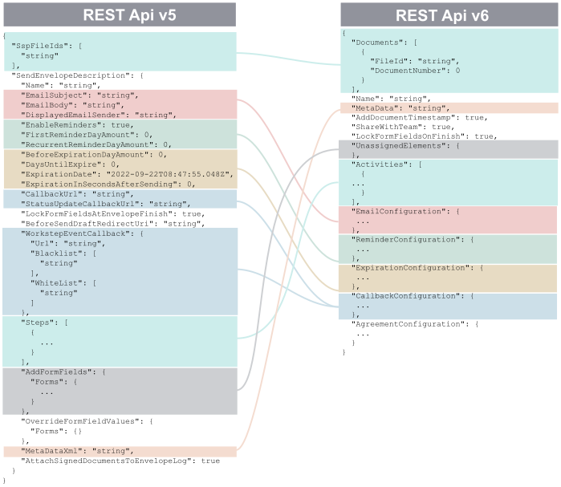

# Migration guide

## Models and types

Due to the heavy updates to the new API version, instead of updating the models and types, we decided to create a new package with the new models and types.

For this reason, to use the old models and types, the import `from esignanywhere_python_client.models import ...` should be replaced with `from esignanywhere_python_client.models.models_v5 import ...`.

Instead, you can import the new models from `esignanywhere_python_client.models.models_v6`.

## Versions

With this new update the default value for the `version` parameter is `v6`.

Due to the deprecation of the old versions, if not specified, the only available version is `v6`.

## Envelope status enumeration

The envelope status values have been reviewed, and status values are now aligned with the status value shown in the WebUI.

| get_envelope v5           | find_envelope v5 | get_envelope v6 | find_envelope v6 | Comment                                                                                                                     |
| ------------------------- | ---------------- | --------------- | ---------------- | --------------------------------------------------------------------------------------------------------------------------- |
| Started                   | Active           | Active          | Active           |                                                                                                                             |
| InProgress                | Active           | Active          | Active           |                                                                                                                             |
| InProgress                | ActionRequired   | Active          | ActionRequired   | ActionRequired is a status interpretation (derived from "Active") in context of the current user who calls envelope/find.   |
| InProgress                | WaitingForOthers | Active          | WaitingForOthers | WaitingForOthers is a status interpretation (derived from "Active") in context of the current user who calls envelope/find. |
| Completed                 | Completed        | Completed       | Completed        |                                                                                                                             |
| CompletedWithWarnings     | Completed        | Completed       | Completed        |                                                                                                                             |
| Canceled                  | Canceled         | Canceled        | Canceled         |                                                                                                                             |
| Rejected                  | Rejected         | Rejected        | Rejected         |                                                                                                                             |
| (ExpiringSoon)            | ExpiringSoon     | Active          | ExpiringSoon     | ExpiringSoon was defined in the v5 model of envelope/get, but actually not used.                                            |
| Expired                   | Expired          | Expired         | Expired          |                                                                                                                             |
| BulkCompleted             | (n/a)            | (n/a)           | (n/a)            | Separated to API methods in "/envelopebulk" route                                                                           |
| BulkPartlyCompleted&nbsp; | (n/a)            | (n/a)           | (n/a)            | Separated to API methods in "/envelopebulk" route                                                                           |
| Draft                     | Draft            | (n/a)           | (n/a)            | Separated to API methods in "/draft" route                                                                                  |
| Template                  | Template         | (n/a)           | (n/a)            | Separated to API methods in "/template" route                                                                               |

## upload_file

This method will return `models_v6.FileUploadResponse` instead of `models_v5.UploadSspFileResult`.
This means that the file id should be read from `response.FileId` instead of `response.SspFileId`.

## create_and_send_envelope

### Request

The body of the request changed widely from `models_v5.EnvelopeSendModel` to `models_v6.EnvelopeSendRequest`.

```
The JSON model of the /v6/envelope methods changed widely, not only to make API usage more easy for new customers. Some changes have been made to allow OAS3 compliancy. Other changes have been done to avoid abstract types and simplify usage of the REST API with several REST API stub generators. By simplifying structures and rethinking defaults, it should also help existing customers after they migrated to v6.

For reasons of simplification, the POST /v6/envelope/send method data are now not separated in the SspFileId array and other SendEnvelopeDescription data any more. The data which were in SendEnvelopeDescription are now directly in the structure of the root element. contains 2 elements directly under the root level:

The definition of referenced documents was just an array called "SspFileId" in API v5. With API v6, it is now an array called "Documents" and contains, for each entry, a structure with the FileId and a DocumentNumber. The naming "FileId" in this structure already shows that it is referencing an element (or otherwise accessible) via one of the /v6/file/* methods. The document number is meant as unique reference of the file within the envelope; avoiding implicit numbering just based on an array index. Other elements e.g. for document visibility are referencing the document by this DocumentNumber.

Instead of having all form fields defined in the "AddFormFields" array of API v5, and define an extra WorkstepTask for those who are assigned to a signer somewhere inside the recipient's workstepConfiguration data, the form fields are now directly defined in the activity definition. Only those form fields which are not assigned to any activity (only signer or automatic signing/sealing activities can have fields assigned) have to be defined in the new "UnassignedElements" array.

Instead of the API v5 "Steps" array, where each step usually had to have exactly one "Recipient" entry regardless of being a human recipient or an automatic service activity, there is now the "Activity" array (and one hierarchy level less). As explained above, we are using the term "Activity" now to follow the common naming of the Business Process Modelling Notation (BPMN) standard, as this fits best for such workflow activities.

Instead of the API v5 "RecipientType", which was just a string datatype and expected values such as "Signer", "Cc" and "Acknowledge", the Activity has now an Action element where exactly one child element (Sign, View, SendCopy, SignAutomatic or SignAsP7M) has to be set with an object. All action-specific configuration is defined inside this action object. The structure of the different action objects differs therefore. There is no separate workstepConfiguration available any more, as all these data belong to the action.

Instead of the API v5 "DocumentOptions" in the Steps element, document visibility is now managed in the "VisibilityOptions" of the Activity. The structure is very similar, but as mentioned above, the DocumentNumber now references to a defined number which is set in the Documents array instead of an implicit numbering based on array position.
```



More information here: [Envelope structure](https://confluence.namirial.com/display/eSign/Envelope+structure)

Here is an example of the new body request:

```json
{
  "Documents": [
    {
      "FileId": "d33d43ca-1234-1234-1234-b645fc4e0fb2",
      "DocumentNumber": 1
    }
  ],
  "Name": "Test",
  "Activities": [
    {
      "Action": {
        "Sign": {
          "RecipientConfiguration": {
            "ContactInformation": {
              "Email": "jane.doe@sample.com",
              "GivenName": "Jane",
              "Surname": "Doe",
              "LanguageCode": "EN"
            }
          },
          "Elements": {
            "Signatures": [
              {
                "ElementId": "sample sig click2sign",
                "Required": true,
                "DocumentNumber": 1,
                "DisplayName": "Sign here",
                "AllowedSignatureTypes": {
                  "ClickToSign": {}
                },
                "FieldDefinition": {
                  "Position": {
                    "PageNumber": 1,
                    "X": 100,
                    "Y": 200
                  },
                  "Size": {
                    "Width": 100,
                    "Height": 70
                  }
                }
              }
            ]
          }
        }
      }
    },
    {
      "Action": {
        "SendCopy": {
          "RecipientConfiguration": {
            "ContactInformation": {
              "Email": "john.doe@sample.com",
              "GivenName": "John",
              "Surname": "Doe",
              "LanguageCode": "EN"
            }
          }
        }
      }
    }
  ]
}
```

The `Activities` array contains objects with the `Action` element. This element contains JUST ONE action to be performed, such as `SendCopy`, `SignAutomatic`, `Sign`, `View`, or `SignAsP7M`.

### Response

Since bulk envelopes are not allowed anymore with this method, the response body changed from `models_v5.SendEnvelopeResult` to `models_v6.EnvelopeSendResponse`.

Old response format:

```json
{
  "BulkChildrenIds": [
    {
      "EnvelopeId": "string",
      "Email": "string"
    }
  ],
  "EnvelopeId": "string"
}
```

New response format:

```json
{
  "EnvelopeId": "string"
}
```

### Bulk envelopes

`create_and_send_envelope` will not allow anymore to send bulk envelopes. To send in bulk, use instead the method `create_and_send_bulk_envelope`.

The body (`models_v6.EnvelopeBulkSendRequest`) is similar but it will allow the use of the `SignBulk` action.

The response instead will be `models_v6.EnvelopeBulkSendResponse` with the following format:

```json
{
  "EnvelopeBulkChildren": [
    {
      "EnvelopeId": "string",
      "BulkRecipientEmail": "string"
    }
  ],
  "EnvelopeBulkParentId": "string"
}
```

## get_envelope

For this method version `v5` is allowed to get the envelopes sent with older versions.
For envelopes created with version `v6`, only `v6` is allowed.

While in previous versions this method returned most of the information in the envelope, starting with version v6 it has been divided into multiple endpoints so it is necessary to make calls to multiple methods:

| Method                     | Version | Description                                                                         | Returned model                             |
| -------------------------- | ------- | ----------------------------------------------------------------------------------- | ------------------------------------------ |
| get_envelope               | v5      | get an overview of an envelope created with v5 API                                  | models_v5.EnvelopeStatus                   |
| get_envelope               | v6      | get an overview of an envelope created with v5 API                                  | models_v6.EnvelopeGetResponse              |
| get_envelope_files         | v6      | get the documents and related files of an envelope                                  | models_v6.EnvelopeGetFilesResponse         |
| get_envelope_history       | v6      | get the event history of an envelope                                                | models_v6.EnvelopeGetHistoryResponse       |
| get_envelope_elements      | v6      | get the elements belonging to the documents of an envelope                          | models_v6.EnvelopeGetElementsResponse      |
| get_envelope_viewer_links  | v6      | get the available links to access the SignAnyWhere Viewer for the active activities | models_v6.EnvelopeGetViewerLinksResponse   |
| get_envelope_configuration | v6      | get the configuration of an envelope and its activities                             | models_v6.EnvelopeGetConfigurationResponse |

Here are some high level changes from v5 to v6:

| Field in v5                     | Method in v6               | Field name in the v6 response                             |
| ------------------------------- | -------------------------- | --------------------------------------------------------- |
| Status                          | get_envelope               | EnvelopeStatus                                            |
| SendDate                        | get_envelope               | SendDate                                                  |
| ExpirationDate                  | get_envelope_configuration | ExpirationConfiguration.ExpirationDate                    |
| ValidityFromCreationInDays      | -                          | -                                                         |
| ExpirationInSecondsAfterSending | get_envelope_configuration | ExpirationConfiguration.ExpirationInSecondsAfterSending   |
| Documents                       | get_envelope_files         | Documents/LegalDocuments (but with a different structure) |

## delete_envelope

No updates required.

## download_completed_document

No updates required.
